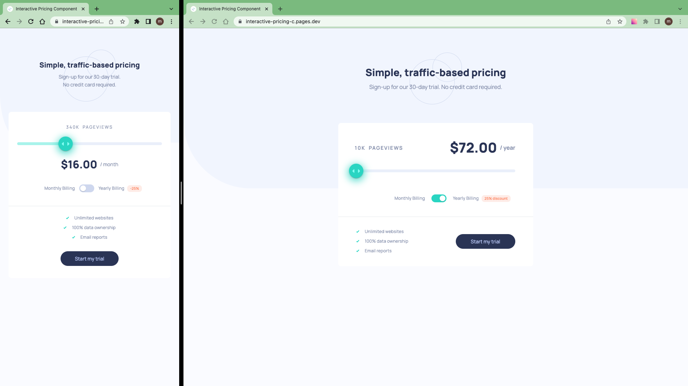

# Frontend Mentor - Interactive pricing component solution

This is a solution to the [Interactive pricing component challenge on Frontend Mentor](https://www.frontendmentor.io/challenges/interactive-pricing-component-t0m8PIyY8).

## Table of contents

- [Overview](#overview)
  - [The challenge](#the-challenge)
  - [Screenshot](#screenshot)
  - [Links](#links)
- [My process](#my-process)
  - [Work time](#work-time)
  - [Built with](#built-with)
- [Author](#author)
- [Acknowledgments](#acknowledgments)

## Overview

### The challenge

Users should be able to:

- View the optimal layout for the app depending on their device's screen size
- See hover states for all interactive elements on the page
- Use the slider and toggle to see prices for different page view numbers

Here are the different page view ranges and the corresponding monthly price totals:

- 10K pageviews / $8 per month
- 50K pageviews / $12 per month
- 100K pageviews / $16 per month
- 500k pageviews / $24 per month
- 1M pageviews / $36 per month

### Screenshot

### Links

- Solution: [frontendmentor.io](https://www.frontendmentor.io/solutions/interactive-pricing-component-eqHaMS8lZp)

- Live Site: [cloudflare](https://interactive-pricing-c.pages.dev/)

## My process

- 1.Download assets, Install Vite & TailwindCss, Initialize git, README.md, Prepare project
- 2.work on pricing component
- 3.Write README.md, Push to github, Make it live on Cloudflare, Publish to frontendmentor

### Work Time

- [My Clockify Report](https://app.clockify.me/shared/649d9dfb1b8eae3a79004324)

### Built with

- [React](https://react.dev)
- [Tailwind CSS](https://tailwindcss.com/)
- [Mui Material UI](https://mui.com/material-ui/)

## Author

- Frontend Mentor - [@siavhnz](https://www.frontendmentor.io/profile/siavhnz)

- github - [@siavhnz](https://www.github.com/siavhnz)

## Acknowledgments

Thanks To

[Frontendmentor.io](https://www.frontendmentor.io/challenges) - for their Excitement challenges

[Perfect Pixel](https://chrome.google.com/webstore/detail/perfectpixel-by-welldonec/dkaagdgjmgdmbnecmcefdhjekcoceebi?hl=en) - for such a great extension
